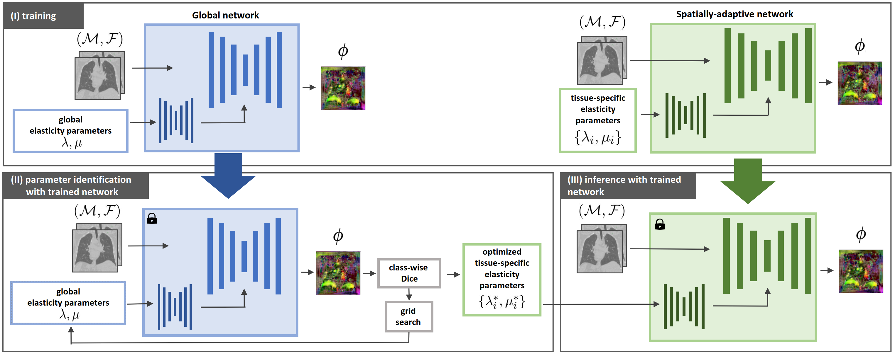

# Data-Driven Tissue- and Subject-Specific Elastic Regularization for Medical Image Registration (MICCAI 2024)

**Anna Reithmeir**, Lina Felsner, Rickmer Braren, Julia A. Schnabel, Veronika A. Zimmer

**Abstract**
Physics-inspired regularization is desired for intra-patient
image registration since it can effectively capture the biomechanical char-
acteristics of anatomical structures. However, a major challenge lies in
the reliance on physical parameters: Parameter estimations vary widely
across the literature, and the physical properties themselves are inher-
ently subject-specific. In this work, we introduce a novel data-driven
method that leverages hypernetworks to learn the tissue-dependent elas-
ticity parameters of an elastic regularizer. Notably, our approach facili-
tates the estimation of patient-specific parameters without the need to
retrain the network. We evaluate our method on three publicly available
2D and 3D lung CT and cardiac MR datasets. We find that with our
proposed subject-specific tissue-dependent regularization, a higher regis-
tration quality is achieved across all datasets compared to using a global
regularizer.

**Keywords** Spatially Adaptive Regularization · Hypernetworks

## Overview

Overview of our method. We train a globally and spatially adaptive network. After training, the optimal tissue-specific elasticity parameters are estimated with the global network. The spatially adaptive network then predicts
the deformation field for the registration of a new image pair that follows the physical properties specified by the parameter values.

## Contents of this repo

- hypermorph_spatially_adaptive : the spatially adaptive models
- datasets.py: Dataloaders for NLST, Learn2Reg Lung CT, ACDC datasets
- regularizers.py: the linear elastic regularizer
- eval_metrics: Evaluation metrics
- train_hypermorph_*.py: training scripts for the diffusion/elastic global/spatially-adaptive models
- parameter_identification.py: Identifying the best regularization parameters with the global models
- inference.py: inference with the spatially-adaptive models and the identified best regularization parameters

Some parts of the code are based on the Voxelmorph/Hypermorph [code](https://github.com/voxelmorph/voxelmorph).

## Setup
1. Install conda
2. Create the 'elastic-hypermorph' conda environment with `conda env create -f environment.yml`